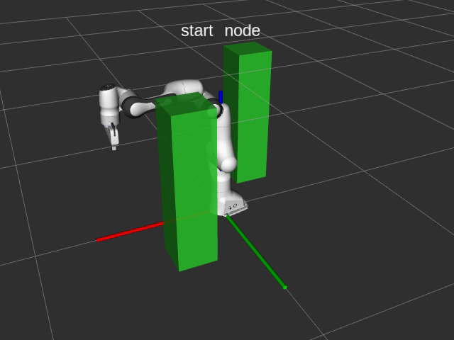
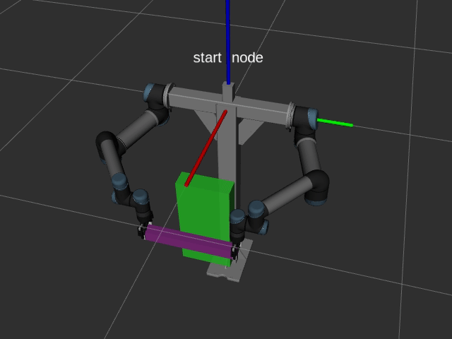

# Studying Sampling-Based Robotic Arm Planning

## Introduction

When I was trying to study the robotic arm planning, I found that most of the courses / tutorials / slides focus on sampling-based planning algorithms such as basic PRMs and RRTs in general environments and use 2-D planning problems and results for illustration. Few materials discuss about the specific settings of the planning for high-DoF robotic arms. Thus, I briefly review the literature of robotic arm planning, and re-implement some representative and easy-to-understand algorithms for learning and practice. Each of the algorithms is published on popular journals or conferences and has been cited more than (around) 100 times. 

These algorithms include:
* Type 1: The goals are specified as the joint positions.
  * RRT ([LaValle, 1998](https://www.cs.csustan.edu/~xliang/Courses/CS4710-21S/Papers/06%20RRT.pdf)): Basic RRT.
  * RRTConnect ([Kuffner et al, ICRA 2000](https://ieeexplore.ieee.org/abstract/document/844730/)): Two trees separately grow from the start configuration and goal configuration.
* Type 2: The goals are specified as tool center point (TCP) poses.
  * JTRRT ([Weghe et al, Humanoid 2007](https://ieeexplore.ieee.org/document/4813913)): During the RRT process, the transpose of the arm Jacobian matrix is used to guide the arm to the target TCP poses with some probability. No inverse kinematics (IK) solver is required. 
  * IKRRT ([Vahrenkamp et al, IROS 2009](https://ieeexplore.ieee.org/abstract/document/5354625)): During the RRTConnect process, new IK solutions for the goal TCP poses are added to the goal tree with some probability. (Note that I don't implement the specific IK approach proposed in the paper, but just refer to the main idea for task-space planning.)
* Type 3: The goals are specified as TCP poses, and the TCP poses are constrained during the path.
  * ATACE ([Yao et al, RAS 2007](https://www.sciencedirect.com/science/article/pii/S092188900600193X)):  It uses the task-space searching to guide the planning. The local movement (velocity) of the TCP is constrained to satisfy the pose constraints.
  * CBiRRT (Berenson et al, [ICRA 2009](https://ieeexplore.ieee.org/abstract/document/5152399), [IJRR 2011](https://journals.sagepub.com/doi/abs/10.1177/0278364910396389)): The main idea is to project random samples (or configurations generated by steering) onto the constraint manifold using the inverse of the arm Jacobian matrix. The searching is in the joint space so the probabilistic completeness is guaranteed. The method proposed by Stilman ([IROS 2007](https://ieeexplore.ieee.org/abstract/document/4399305), [TRO 2010](https://ieeexplore.ieee.org/abstract/document/5467152)) has the similar idea.

In this repository, I write the source code for the main planning procedures, and use MoveIt! for the planning scene setup, robotic kinematics solving, and collision checking, which makes it more convenient to install the dependencies.

Please note that this repository is not a library for general usage, but may be helpful for learners to understand the details of the arm planners. 


## Dependencies
These dependencies should be properly installed ahead.
* ROS noetic
* MoveIt!
* Eigen3

## Installation

Clone the repositry:
```bash
$ git clone https://github.com/Mingrui-Yu/arm_planning.git
```

Clone the third-party packages:
```bash
$ cd arm_planning/ws_catkin/src

$ git clone https://github.com/ros-planning/panda_moveit_config.git -b noetic-devel
$ git clone https://github.com/THU-DA-Robotics/universal_robot.git -b calibration_devel
$ git clone https://github.com/THU-DA-Robotics/robotiq.git -b noetic-devel
$ git clone https://github.com/THU-DA-Robotics/dual_ur.git -b noetic_devel
```

Automatically install other dependencies:
```bash
$ cd arm_planning/ws_catkin
$ rosdep install --from-paths src --ignore-src -y
```

Build the catkin workspaces:
```bash
$ cd arm_planning/ws_catkin
$ catkin_make -j4
```

## Usage

In the single-arm planning, I use a 7-DoF Franka Emilka Panda arm.
In the dual-arm, I use two 6-DoF UR5 arms installed on a base holder (the robot in [our lab](https://github.com/THU-DA-Robotics)).

### Single-arm planning with joint-space goals

The planning goals are specified as the goal arm joint positions. The RRT and RRTConnect are tested.

First,
```bash
$ roslaunch arm_planning panda_sim_prepare.launch
```
Then,
```bash
$ rosrun arm_planning test_2
```

<p align="center">
  
</p>


### Single-arm planning with task-space goals

The planning goals are specified as the goal poses of the tool center point (TCP). The JTRRT and IKRRT are tested.

First, 
```bash
$ roslaunch arm_planning panda_sim_prepare.launch
```
Then,
```bash
$ rosrun arm_planning test_3
```

<p align="center">
  
</p>

### Single-arm planning with task-space goals and constraints
The planning goals are specified as the goal poses of the tool center point (TCP). Moreover, the poses of the TCP are also constrained during the paths (e.g., Z-axis down). The ATACE and CBiRRT are tested.

First, 
```bash
$ roslaunch arm_planning panda_sim_prepare.launch
```
Then,
```bash
$ rosrun arm_planning test_4
```

<p align="center">
  
</p>


### Dual-arm planning with closed-chain constraints
During the path, the two arms should bimanually grasp the object, which is so-called a closed-chain constraint. The planning goals can be specified as the goal joint positions (more efficient) or goal TCP poses (less efficient). The CBiRRT is tested.

First, 
```bash
$ roslaunch dual_arm_planning dual_ur_sim_prepare.launch
```
If using joint-space goals:
```bash
$ rosrun dual_arm_planning dual_arm_planning_test_3
```
Or if using task-space goals:
```bash
$ rosrun dual_arm_planning dual_arm_planning_test_4
```

<p align="center">
  
</p>
